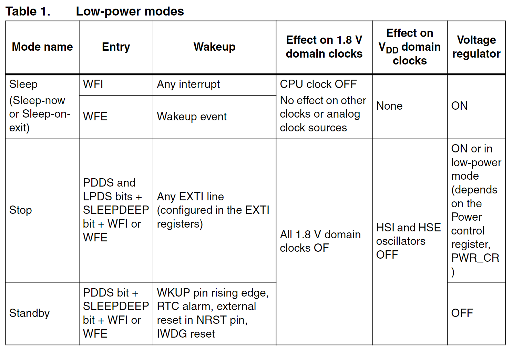

# `STM32F1`低功耗模式
## 参考
1. `Application Note: AN2629`
2. [博客：`low power mode in stm32`](https://controllerstech.com/low-power-modes-in-stm32/)

## 使用
1. 修改`LOW_POWER_MODE`宏定义为指定低功耗模式，然后编译烧录即可；

## 说明
1. 三种低功耗模式总结

> ### Sleep mode
> 1. 可通过任意中断唤醒，所以通过按键，串口接收中断等方式都可以；也可以通过唤醒事件唤醒；（外部触发的叫中断，内部触发的叫事件）
> 2. 因为`sysTick`中断也会唤醒`sleep mode`，而`sysTick`默认每毫秒都产生一次中断，所以为了避免被这个中断唤醒，进入`sleep`前需要关闭`sysTick`；
> 3. 由于进入`sleep`关闭了`sysTick`，所以唤醒`sleep`后需要重启`sysTick`；
> 4. 配置`HAL_PWR_EnableSleepOnExit()`进入`sleep`后，每次唤醒后都只执行中断中的代码，执行完后自动进入`sleep`；除非在中断中通过`HAL_PWR_DisableSleepOnExit`退出；
> 5. 在`Sleep`模式下，`MCU`不再工作，外设可以工作，串口依旧是可以打印的；寄存器和`RAM`保存；

> ### Stop mode
> 1. 可通过任意`EXTI`中断唤醒，注意和`Sleep`的区别，串口中断可以唤醒`Sleep`，但是不能唤醒`Stop`；
> 2. `Stop`模式下，`HSE`关闭，所以唤醒后，需要调用`SystemClock_Config()`重新配置系统时钟；
> 3. 同理，进入、退出`Stop mode`也需要关闭、开启`sysTick`；
> 4. `Stop mode`也可以使用`HAL_PWR_EnableSleepOnExit()`；
> 5. `Stop`模式下，`MCU`不再工作，串口不能打印；寄存器和`RAM`的数据保存；

> ### standby mode
> 1. `Standby mode`和前面两个不一样，前面两个低功耗模式被唤醒后，可以接着在进入低功耗模式的地方运行，而`Standby`唤醒后会复位`MCU`，只能通过`PWR_FLAG_SB`状态位判断是正常的复位重启还是由于唤醒`Standby`产生的复位重启；
> 2. `Standby`可以被`WKUP`管脚，`RTC alarm`，`NRST`管脚，`IWDG reset`唤醒；
> 3. 除了备份寄存器，其他寄存器和`RAM`的值将丢失，所以唤醒后必须要重启！